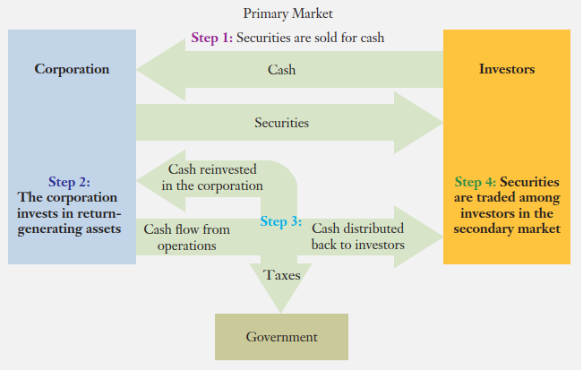

[{width="10%"}](https://bangtedy.github.io/menkeu23)

## Capaian Pembelajaran

1. Students should be able to describe the structure and functions of 
financial markets.
2. Students should be able to distinguish between commercial banks 
and other financial institutions in the financial marketplace.
3. Students should be able to describe the different securities markets 
for bonds and stocks.

## Pasar Keuangan

1. Borrowers. Those who need money to finance their purchases. These include businesses that need money to finance their investments or to expand their inventories as well as individuals who borrow money to purchase a new automobile or a new home.
2. Savers (Investors). Those who have money to invest. These are principally individuals who save money for a variety of reasons, such as accumulating a down payment for a home or saving for a return to graduate school. Firms also save when they have excess cash.
3. Traders and Speculators. Those who borrow and invest with the sole purpose of mak-
ing profits from the market. They act as both borrowers and savers in the market but their borrowing is not intended to fund a business and neither is their investment based on savings siphoned out of a commercial activity.
4. Financial Institutions (Intermediaries). The financial institutions and markets that help bring borrowers and savers together. The financial institution you are probably most familiar with is the commercial bank, a financial institution that accepts deposits and makes loans.

### Lembaga-Lembaga Keuangan (Perantara Keuangan)

Perhatikan Gambar dibawah!

**Diskusi**:

1. Bagaimana seseorang dan sebuah perusahaan menggunakan perantara keuangan (financial intermediaries) untuk mendapatkan dana di pasar keuangan?
2. Apakah perbedaan antara bank komersial, bank investasi, dan lembaga keuangan bukan bank?

### Pasar Sekuritas

-  A security is a negotiable instrument that represents a financial claim. It can take the form of ownership (stock) or a debt agreement (bond).
- A primary market is a market in which new, as opposed to previously issued, securities are bought and sold for the first time.
- The secondary market is where all subsequent trading of previously issued securities takes place.

## Bagaimana Pasar Sekuritas Mempertemukan Perusahaan dengan Investor?

Perhatikan Gambar Pasar Sekuritas

1. The firm sells securities to investors. The firm raises money in the securities markets by selling either debt or equity.
2. The firm invests the funds it raises in its business. The firm invests the cash raised in the securities markets in hopes that it will generate cash flows—for example, it may invest in a new restaurant, a new hotel, a factory expansion, or a new product line.
3. The firm distributes the cash earned from its investments. The cash flow from 
the firm’s investments is reinvested in the firm, paid to the government in taxes, or distributed to the investors who own the securities issued in step 1.
4. The firm’s securities are traded in the secondary market. Immediately after the 
firm’s securities are sold to the public, the investors who purchased them are free to resell them to other investors.

## Jenis-Jenis Sekuritas

1. Sekuritas Hutang
2. Sekuritas Ekuitas
    - Common stock (saham biasa)
    - Preferred stock

## Bursa Saham

- A stock market is a public market in which the stock of companies is traded.
- Coba kunjungi: finance.yahoo.com
- Masukkan nama perusahaan yang Anda minati, misal Astra Agro Lestari

## Surat Hutang/Obligasi

- SUN
- SBN
- ??

## Diskusi:
1. Apakah perbedaan antara sekuritas hutang dengan sekuritas ekuitas?
2. Jelaskan perbedaan antara pasar primer dengan pasar sekunder!
3. Jelaskan perbedaan antara saham biasa dengan saham preferen!
4. Jelaskan apakah yang dimaksud dengan reksa dana!
5. Jelaskan beberapa lembaga perantara keuangan selain bank di Indonesia!

